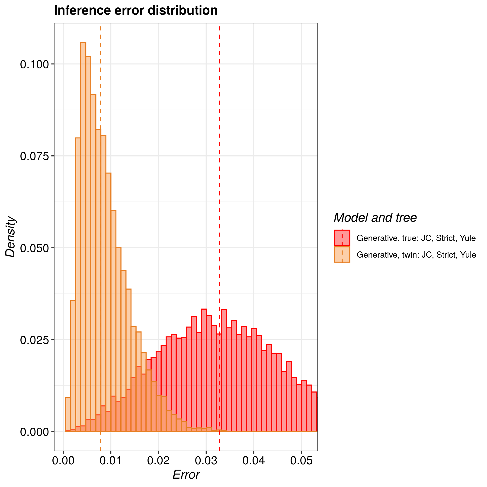

# pirouette_example_7

Branch   |                                                                                               |                                                                                               
---------|------------------------------------------------------------------------------------------------------------------------------------------------------------|--------------------------------------------------------------------------------------------------------------------------------------------------------------------------------------------
`master` | |
`develop`||

A [pirouette example](https://github.com/richelbilderbeek/pirouette_examples).

## Results

